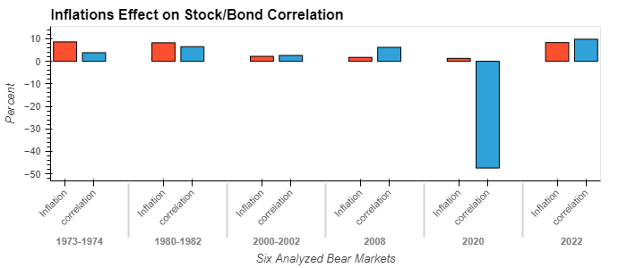

# **Project-1: Analyzing Bear Markets in Traditional Markets and Crypto**

---
## Motivation and Summary:
The purpose of this project is to get a better understanding of how bear markets work. We wanted to understand a few things: First we wanted to see how long previous bear markets have lasted in both traditional and crypto markets, as well as how large the typical drawdown is that can be expected. Next, we also wanted to answer how volatile these markets can be and specifically how inflation can effect the typical negative correlation seen between stock and bond prices when recessions occur. Finally, we also wanted to see how yields can effect and predict the oncoming of recessions/bear markets and take a look at the effect of inflation and the federal funds rate as the federal reserve has attempted to tame infaltion in the past. We asked these questions to get a general sense of where we may now be in the market and what we could potentially expect to see in the future.
>
We were able to come to conclusions on all these fronts. We found that 

---
## Questions and Data:
To answer these questions, we needed a large quantity of data. In order to determine the length and drawdowns of these bear markets we needed a total history of closing data across traditional and crypto markets. We got this data from two sources. We got the data from the SP500 from the Federal Reserve Bank of St.Louis and we got the market data for crypto by using the Alpacas API. Using this data we were able to calculate the drawdowns, volatility, and duration of bear markets starting from ~1970 all the way to now. 
>
Furthermore, we gathered data on the two-year gov't bond yields and ten-year gov't bond yields, as well as historical inflation data and federal funds rates from the Federal Reserve Bank of St.Louis. Using this data we were able to analyze yield curve inversions, the stock/bond volatility, and also how fed funds rates effect inflation.
>
Ultimately, from traditional markets, we analyzed six of the most prominent bear markets that have occured in history. This consisted of the bear markets of 1973-1974, where inflation begun to initially arise in the U.S. and the bear of 1980-1982, where Paul Volker began to raise interest rates to extreme levels in order to tame inflation. The other bears included the dotcom bubble burst of 2000, the great financial crisis of 2008, the 2020 covid bear market, and the current bear market we're in currently.

---
## Data Cleanup and Exploration:
The data cleanup and exploration process was arduous. There were many problems that we faced that we didn't initially expect... and alot of gratuity for the clean and simple data csv's provided for us on the class activities and homework. In reality, when pulling data from multiple different sources and trying to compare and mix dataframes, it's much more difficult than it may seem on the surface. The date order in many dataframes may be different from the order provided by different sources, some sources include timestamps that need to be removed from the data in order to filter through it. That was one issue that we faced- two sources of data included time stamps that needed to be removed, and upon removing them, changed the date from timestamp format to datetime format. Apparently, you cant concatenate two dataframes with two different time formats - even if they look *exactly* the same. To fix this we did some research and found that in order to filter through the dates we had to use the pd.datetime function and manually enter the start and end dates, and then using .loc, we were able to narrow down the data into segmented dataframes representing each respective bear market. Another issue we faced was that when bringing in data from the SP500, the closing values were considered to be strings. So while attempting to get pct change, we would get errors. This was a much easier an quicker fix as we had seen it in class before, and we just reassigned the datatype as float.
>
Below, we'll include some of our favorite figures that we created while analyzing the data:
>

>
This first graph illustrates what we had originally thought when going into the data analysis. It can be seen that in times of high inflationary periods, that the typical negative correlation seen between stocks and bonds no longer tends to hold. The red bar graphs illustrate the inflation rate at the time of the bear market and the blue bar represents the correlation between stocks and bonds. The first two bear markets from left to right represent the years of 73-74 and 80-82, respectively. These time periods had bouts of high inflation and due to this, investors did not flee to bonds as a safe invetment due to the interest rate risk associated with the federal reserve increasing interest rates. The recession with the largest blue bar shows the most extreme value for the stock bond correlation, in which returns are very negatively correlated. This is due to inflation being very low, and investors fleeing to bonds as a safe haven given the covid crisis. This reinforces our idea that in times of high inflation, typical stock/bond correlation does not hold, where as in bear markets with low inflation it does. 
>

